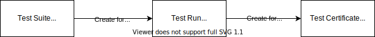
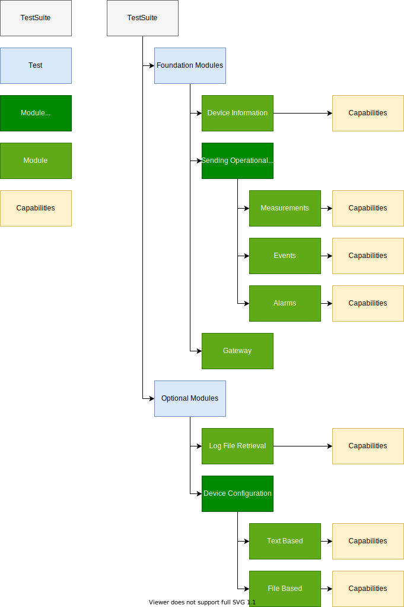

# Information Model of Device Certification Microservice & Application



## Test Suite

The test suite is created by the technical partner management team at Software AG and has a hierarchical structure:



The test suite data structure is used by the UI to generate the list of to be tested items.

The `c8y_certification_testSuite` object is represented in the following json format:

```json5
{
  "type": "c8y_certification_testSuite", // set by MS: type of the manged object
  "version": "1.3", // for (manual) comparison
  "tests": [
    {
      "id": "foundationModules",
      "title": "Foundation Modules",
      "modules": [
        {
          // simple module
          // - only hosting capabilities.
          // - listing children on fragment `capabilities`.
          "id": "deviceInformation",
          "title": "Device Information",
          "mandatory": true, // boolean or omitted (= false)
          "container": false, // boolean or omitted (= false),
          "capabilities": [
            {
              "id": "c8y_IsDevice",
              "title": "c8y_IsDevice",
              "mandatory": true,
            },
          ],
        },
        {
          // container module
          // - hosting further modules.
          // - limited to one layer.
          // - children listed on fragment `modules`.
          "id": "sendingOperationalData",
          "title": "Sending Operational Data",
          "mandatory": true,
          "container": true,
          "modules": [
            {
              "id": "operationDataMeasurements",
              "title": "Measurements",
              "capabilities": [
                {
                  "id": "operationDataMeasurements_Source",
                  "title": "Device ID",
                  "mandatory": true,
                },
                {
                  "id": "operationDataMeasurements_Type",
                  "title": "Type of measurement",
                  "mandatory": true,
                },
                {
                  "id": "operationDataMeasurements_Time",
                  "title": "Date and time when the measurement was made",
                  "mandatory": true,
                },
              ],
            },
          ],
        },
      ],
    },
  ],
}
```

## Test Run

When the user creates a new `Product`in the UI, a new `c8y_certification_testRun` object is created for this product if there is no entry already.
The test run object is instantiated from the test suite data structure, by adding the `product` fragment and a `status` fragment to each `capability`.

```json5
{
  "type": "c8y_certification_testRun", // set by MS: type of the manged object
  "version": "1.3",
  "c8y_version": "1010.0.8",
  "testSuite": "123456",
  "certificate": "234567", // testCertifcate ID
  "status": {
    "code": "PENDING"
  },
  "hashValue": "2e400e60b947152aec082aadcc1d820a", // set by MS: md5 hash value to make sure only SAG can change this
  // product details
  "product": {
    "productName": "BCM2708 000e", // set by user
    "productType": "Device",
    "vendorName": "Partner Company", // set by user
    "deviceId": "9656728", // set by MS: device id taken from the device managed object
    "parentId": "9656729", // set by MS: if there is a parent this should be the connection
  },
  // module listing -->
  "deviceInformation": {
    "parent": "foundationModules",
    "status": { // set by MS: added to indicate the status of each capability
      "code": "FAILED", // set by MS
      // text is not required/used for modules
    },
    "mandatory": true, // boolean or omitted (= false)
    "capabilities": [
      {
        "id": "c8y_IsDevice",
        "mandatory": true,
        "status": {
          "code": "FAILED",
          "text": "The fragment <code>c8y_IsDevice</code> is not set."
        },
      },
    ],
  },
  // parts (container: true modules) only reflect their status
  "sendingOperationalData": {
    "parent": "foundationModules"
  },
  // part children are listed as before 
  "operationDataMeasurements": {
    "parent": "sendingOperationalData",
    "status": { // set by MS: added to indicate the status of each capability
      "code": "FAILED", // set by MS
    },
    "capabilities": [
      {
        "id": "operationDataMeasurements_Source",
        "mandatory": true,
        "status": {
          "code": "FAILED",
          "text": "Lorem ipsum dolor sit amet."
        },
      },
      {
        "id": "operationDataMeasurements_Type",
        "mandatory": true,
        "status": {
          "code": "FAILED",
          "text": "Lorem <strong>ipsum dolor</strong> sit amet."
        },
      },
      {
        "id": "operationDataMeasurements_Time",
        "mandatory": true,
        "status": {
          "code": "FAILED",
          "text": "Lorem ipsum dolor <i>sit</i> amet."
        },
      },
    ]
  },
}
```

### Life Cycle of a Test Run

The life cycle of a test run is captured in the status of all tested capabilities. `tests.modules.capabilities.status.code`can have the following values:

| Value         | Meaning                                                                                |
| ------------- | -------------------------------------------------------------------------------------- |
| `PENDING`     | Test was not executed yes                                                              |
| `EXECUTING`   | Test is currently in execution                                                         |
| `SUCCESSFUL`  | Test executed and returned successful state                                            |
| `FAILED`      | Test executed and returned failed state                                                |
| `UNSUPPORTED` | **For optional modules only**. Set if device does not indicate to support this capability. |

When a test run object is created, all tests are set to `PENDING` state.
When a test is stated, it sets the respective status to `EXECUTING`.
When a test is finished, it sets the state `SUCCESSFUL` or `FAILED`, together with a descriptive text that helps the user to debug put in the `tests.modules.capabilities.status.text` fragment.

## Test Certificate

When all mandatory test are in `SUCCESSFUL` state, the user can decide to create a test certificate by clicking the respective button in the UI.
This creates a snapshot of the current `c8y_certification_testRun` object and adds the `certificate` and `hashValue` fragments to create a `c8y_certification_testCertificate`.
This newly created object is immutable in the sense that all test results cannot be changed.

```json5
{
  "type": "c8y_certification_testCertificate", // set by MS: type of the manged object
  "version": "1.3",
  "hashValue": "2e400e60b947152aec082aadcc1d820a",
  // product details
  "product": {
    "productName": "BCM2708 000e",
    "vendorName": "Partner Company",
    "deviceId": "9656728",
    "parentId": "9656729",
  },
  // certificate details (set by MS)
  "certificate": {
    "creationDate": "2021-08-10T05:54:38.107Z", // date of certification
    "c8yVersion": "1010.0.8", // C8Y backend version at time of certification
    "pdfDocument": "https://t10452223.eu-latest.cumulocity.com/inventory/binaries/7101509", // Links to the stored document in the blob storage
    "status": {
      // status of the certificate, @see certificate life cycle
      "code": "VALID", // overall test status
      "text": "Certification is valid", // long text of overall test status, eg for display in UI
    },
  },
  // test defintion -->
  "tests": [
    {
      "id": "foundationModules",
      "title": "Foundation Modules",
      "modules": [
        {
          // simple module
          "id": "deviceInformation",
          "title": "Device Information",
          "mandatory": true,
          "status": {
            "code": "FAILED",
            // text is not required/used for modules
          },
          "capabilities": [
            {
              "id": "c8y_IsDevice",
              "title": "c8y_IsDevice",
              "mandatory": true,
              "status": {
                "code": "FAILED",
                "text": "The fragment <code>c8y_IsDevice</code> is not set."
              },
            },
          ]
        },
        {
          // container module
          "id": "sendingOperationalData",
          "title": "Sending Operational Data",
          "mandatory": true,
          "container": true,
          "modules": [
            {
              "id": "operationDataMeasurements",
              "title": "Measurements",
              "type": "container",
              "status": {
                "code": "FAILED"
                // text is not required/used for modules
              },
              "capabilities": [
                {
                  "id": "operationDataMeasurements_Source",
                  "title": "Device ID",
                  "mandatory": true,
                  "text": "Lorem ipsum dolor sit amet."
                },
                {
                  "id": "operationDataMeasurements_Type",
                  "title": "Type of measurement",
                  "mandatory": true,
                  "text": "Lorem <strong>ipsum dolor</strong> sit amet."
                },
                {
                  "id": "operationDataMeasurements_Time",
                  "title": "Date and time when the measurement was made",
                  "mandatory": true,
                  "text": "Lorem ipsum dolor <i>sit</i> amet."
                },
              ]
            },
          ]
        },
      ]
    },
  ]
}
```

### Life Cycle of a Test Certificate

The life cycle of a test certificate is captured in the `certificate.status` fragment. `certificate.status.code` can have the following values:

| Value     | Meaning                                |
| --------- | -------------------------------------- |
| `VALID`   | Certification is valid                 |
| `EXPIRED` | Certification has expired              |
| `REVOKED` | Certification was revoked by SAG admin |

Ones a certificate is created, it is set to `VALID` state.
A separate microservice compares the `certificate.creationDate` regulars against a set expiration duration and sets the state to `EXPIRED` if the expiration date is reached.
Additionally, an administrator can manually set the state to `REVOKED`, e.g. if a company leaves to partner program or incompliance is detected.

## Change log

- 2021-11-04 // D. Peter
  adjusted datamodel to incoporate an optional grouping level between module and capability
  - added fragment `container` to modules
  - refactored the json structure of `testSuite`, `testRun` and `testCertificate`
- 2021-10-27
  added a new layer between modul and capability named part , to get more things in detail covered.
- 2021-10-15
  removed the sentenace "The only modifiable fragment is `certificate.status`, to represent the certificates life cycle." Because this is not what we want and would leave to an admin the possibillity to change the status from "outside"
- 2021-09-30
  - testSuit:
    - reverted to use arrays for tests, modules and capabilities to maintain their order. an update via put seems not to be required.
    - `mandatory` added to modules
  - testRun:
    - added `c8y_version`, `testSuit`-reference and overall `status` to root level
