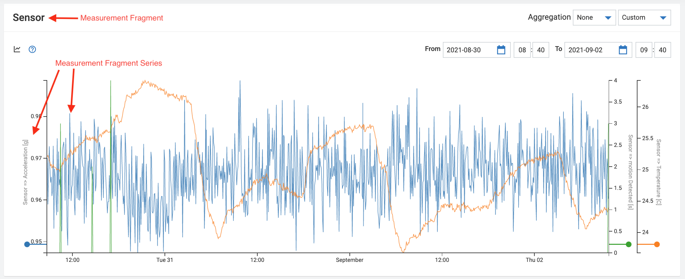

# Vendor Requirements for Device Certification

This document provides guidance on which requirements a connector/agent needs to fulfill to be successfully certifiable using the Cumulocity IoT certification tool.
The device certification process requires all connectors / agents that run on devices to follow standards and integration best practices. This means that more fields are mandatory for a certified device compared to platform minimum requirements.
The following section, [Device Registration](#device-registration), covers the registration processes for connectors/agents using either the MQTT API or the REST API. The mandatory capabilities are described in section [Foundation Capabilities](#foundation-capabilities-for-vendor-device-certification-mandatory). All advanced capabilities are part of the section [Extended Capabilities](#extended-capabilities-for-vendor-device-certification-optional).

# Device Registration

The chapter [Device Behavior](#device-behavior) describes how a connector/agent that runs on a device registers to Cumulocity IoT. The connector/agent must send a mandatory minimum of information to be certifiable. This is covered in the section [Foundation Capabilities](#foundation-capabilities-for-vendor-device-certification-mandatory). 


## Device Behavior

When  started, the device follows the process flow defined for REST or MQTT based integration respectively.

**Please read and follow one of these guides:**


For *[REST Based Integrations Cumulocity IoT Documentation](https://cumulocity.com/guides/10.16.0/device-integration/rest/)*:


For *[MQTT Based Integrations Cumulocity IoT Documentation](https://cumulocity.com/guides/device-sdk/mqtt/#device-integration)* (using Smart-Rest 2 is recommended):


### Helpful MQTT Info


* [MQTT Cheat Sheet (Comprehensive)](https://github.com/SoftwareAG/cumulocity-self-service-certification/blob/main/docs/cheatSheet.md)
* [MQTT Quick Reference Cumulocity IoT Documentation](https://cumulocity.com/guides/device-sdk/mqtt/#quick-reference)
* [MQTT Static Templates Cumulocity IoT Documentation](https://cumulocity.com/guides/device-sdk/mqtt/#templates-quick-reference)


## Certificates

**Cypher Suits:**

Cumulocity IoT fulfills SSL Labs A+ rating and therefore supports exclusively the following cypher suits from release [Release 10.9](https://cumulocity.com/guides/releasenotes/release-10-9-0/announcements-10-9-0/) and the old AES-CBC ciphers[Release 10.10](https://cumulocity.com/releasenotes/release-10-10-0/announcements-10-10-0/) :

* TLS-AES-256-GCM-SHA384
* TLS-CHACHA2O-POLY1305-SHA256
* TLS-AES-128-GCM-SHA256
* ECDHE-RSA-AES256-GCM-SHA384
* DHE-RSA-AES256-GCM-SHA384
* ECDHE-RSA-CHACHA20-POLY1305
* DHE-RSA-CHACHA20-POLY1305
* ECDHE-RSA-AES128-GCM-SHA256
* DHE-RSA-AES128-GCM-SHA256
* ECDHE-RSA-AES256-SHA384
* DHE-RSA-AES256-SHA256
* ECDHE-RSA-AES128-SHA256
* DHE-RSA-AES128-SHA256
* AES256-GCM-SHA384
* AES128-GCM-SHA256
* AES256-SHA256
* AES128-SHA256

## Certification of Devices and Aggregation as Products

When a connector/agent registers on Cumulocity IoT, it becomes a device listed in the Device Management application. When using the self-certification tool, one certificate can be created for each combination of the connector (c8y_Agent), the Hardware (c8y_Hardware) and the Firmware (c8y_Firmware). If any of these values change, a new device-certificate can be created. The Cumulocity IoT device certification API makes the certification information available for our [Device Partner Portal](#https://devicepartnerportal.softwareag.com/). Entries on the Device Partner Portal represent devices from a sales/user perspective, which is therefore defined as a product. Products can only be segregated by their names. To link the product from the Device Partner Portal with the more granular differentiation of a device on Cumulocity IoT, we have incorporated this as manual steps within the Cumulocity IoT certification tool. Device certificates therefore need to be clustered to products, so all the device certificates related to that product can then be displayed under the same product on the Device Partner Portal. The product to device relation is 1:n. 


# Foundation Capabilities for Vendor Device Certification (mandatory)


For details and examples, see the [Device Management Library](https://cumulocity.com/guides/reference/device-management-library/#device-info) section of the Cumulocity IoT Open API documentation as well as the detail sections below.

| Fragment                     | Description                                                                         | Mandatory                                                                                                                                                   |
| ---------------------------- | --------------------------------------------------------------------------------------------------------- | ----------------------------------------------------------------------------------------------------------------------------------------------------------- |
| `c8y_Agent`                  | Information about the agent run on the device                                                            | Yes        |
| `c8y_IsDevice`               | Empty fragment. Defines the managed object created through the Inventory API to be a Device                                                     | Yes                                                                                            |
| `name`                       | Sets the name of the device used e.g. in 'all devices' and 'device info' views                            | Yes                                                                                                                                                         |
| `type`                       | Functional type of device e.g. water meter, pump, Gateway, environmental sensor                           | Yes                                                                                         |
| `c8y_RequiredAvailability`   | Minimal communication interval to determine if device is offline                                          | No        |
| `c8y_Firmware`               | Firmware information about the device                                                                     | Yes                                                                                                              |
| `c8y_Hardware`               | Hardware information about the device                                                                     | Yes                                                                                                                                                        |
| `externalIds`                | Used to identify a device with a unique information from the physical world                               | Yes    |                                                         
    

Information about one physical device is stored within multiple managed objects each accessible through one endpoint of the Cumulocity IoT API. All general device information must be stored in one managed object that can be accessed via the inventory endpoint. The following JSON structure represents a typical managed object of a device accessible through the inventory API endpoints ( e.g. `GET {{url}}/inventory/managedObjects/{{deviceId}}`):

```json5
"c8y_IsDevice": {},
"com_cumulocity_model_Agent": {},
"name": "edge-agent-eabdcf5d344b4a52a4ffab13fe3d11cb",
"type": "c8y_EdgeAgent",
"c8y_Agent": {
    "name": "DeviceAgent",
    "version": "1.0",
    "url": ""
},
"c8y_RequiredAvailability": {
    "responseInterval": 6
},
"c8y_Firmware": {
    "name": "raspberrypi-bootloader",
    "version": "1.20140107-1",
    "url": "31aab9856861b1a587e2094690c2f6e272712cb1"
},
"c8y_Hardware": {
    "model": "BCM2708",
    "revision": "000e",
    "serialNumber": "00000000e2f5ad4d"
}
```
## Agent Information
The term “agent” refers to the piece of software that connects a device with Cumulocity IoT. This document provides guidance for integration developers to develop this agent. The fragments `c8y_Agent` must be sent to the inventory endpoint of the API to add it to the device managed object. 
For details and examples, compare *[What is an agent? Cumulocity IoT Documentation](https://cumulocity.com/guides/concepts/interfacing-devices/#agents)*.

### c8y_Agent

The device certificate will be issued for a device by the properties `c8y_Agent.name`, `c8y_Agent.version`,  `c8y_Hardware.model`, `c8y_Hardware.revision`, `c8y_Firmware.name`, and `c8y_Firmware.version`. Developers of this agent are free to chose the name and version. 

[Example of an “agent” named “c8yMQTT”](https://github.com/SoftwareAG/c8yMQTT).
[Cumulocity IoT Documentation of c8y_Agent Fragment](https://cumulocity.com/guides/reference/device-management-library/#agent-information).


| Fragment  | Mandatory |
| --------- | --------- |
| `name`    | Yes       |
| `version` | Yes       |
| `url`     | No        |

Example JSON structure of a managed object accessible through the inventory API endpoints:

```json5
"c8y_Agent": {
    "name": "myCustomAgent",
    "version": "1.2.34",
    "url": "https//link-to-agent-repo.url"
}
```
**Using MQTT?:** Please send agent information as JSON via MQTT to topic: `inventory/managedObjects/update/<deviceID>`.


## Basic Device Information

The fragments `c8y_IsDevice`, `name`, `type`, `c8y_RequiredAvailability`, `c8y_Firmware`, and `c8y_Hardware` must be present in the managed object accessible through the inventory API endpoints. 

### name

The Cumulocity IoT UI uses the device `name`. Here, `name` sets the name of the device used, e.g. in 'all devices' and 'device info' views.
For details and examples, see [Managed Objects Cumulocity IoT Documentation](https://cumulocity.com/api/core/#operation/postManagedObjectCollectionResource).

| Fragment | Mandatory |
| -------- | --------- |
| `name`   | Yes       |

Example JSON structure of a managed object accessible through the inventory API endpoints:

```json5
"name": "ExampleDeviceName"
```

### c8y_IsDevice

`c8y_IsDevice` is an empty fragment that declares the managed object accessible through the inventory API endpoints as a device. 
For details and examples, see [Managed Objects Cumulocity IoT Documentation](https://cumulocity.com/api/core/#operation/postManagedObjectCollectionResource).


| Fragment | Mandatory |
| -------- | --------- |
| `c8y_IsDevice`   | Yes       |

Example JSON structure of a managed object accessible through the inventory API endpoints:

```json5
"c8y_IsDevice": {} 
```

### type

The fragment `type` can be interpreted as `_device class_`. Meaning, devices with the same `type` can receive the same types of configuration, software, firmware, and operations. `Type` value is indexed and is therefore used for queries. Cumulocity IoT UI for example uses it for filtering purposes like sending a software package to all devices of one specific `type` and to assign Dashboards to devices of the same `type`.
For details and examples, see [Managed Objects Cumulocity IoT Documentation](https://cumulocity.com/api/core/#operation/postManagedObjectCollectionResource).

| Fragment | Mandatory |
| -------- | --------- |
| `type`   | Yes       |

Example JSON structure of a managed object accessible through the inventory API endpoints:

```json5
"type": "c8y_EdgeAgent"
```

### c8y_RequiredAvailability


Minimal communication interval to determine if device is offline. 

For details and examples, see [Device Availability Cumulocity IoT Documentation](https://cumulocity.com/api/core/#section/Device-management-library/Device-availability).


| Fragment           | Mandatory |
| ------------------ | --------- |
| `responseInterval` | No        |

Example JSON structure of a managed object accessible through the inventory API endpoints:

```json5
"c8y_RequiredAvailability": {
    "responseInterval": 6
}
```
## Hardware Information

Hardware information can be stored within the fragment `c8y_Hardware` that is part of the inventory managed object accessible through the inventory API endpoints. The device certificate will be issued for device defined by: `c8y_Hardware.model`, `c8y_Hardware.revision`, `c8y_Firmware.name`, `c8y_Firmware.version`, `c8y_Agent.name`, and `c8y_Agent.version`.
These fragments will also be used in future versions of Device Partner Portal. It displays one "Device" entry in the overview device list per `c8y_Hardware.model` and a dropdown menu in the device detail view for each `c8y_Hardware.revision`. 

For details and examples, see [Hardware Information Cumulocity IoT Documentation](https://cumulocity.com/guides/reference/device-management-library/#hardware-information).

### c8y_Hardware

| Fragment       | Meaning in Device Partner Portal                                        | Mandatory |
| -------------- | ----------------------------------------------------------------------- | --------- |
| `model`        | Device in list view                                                     | Yes       |
| `revision`     | Dropdown inside device detail view to select device revision or version | Yes       |
| `serialNumber` | Not used in Device Partner Portal                                       | Yes       |

Example JSON structure of a managed object accessible through the inventory API endpoints:

```json5
"c8y_Hardware": {
    "model": "BCM2708",
    "revision": "000e",
    "serialNumber": "00000000e2f5ad4d"
}
```

## Firmware Information

Firmware information can be stored within the fragment `c8y_Firmware` that is part of the inventory managed object accessible through the inventory API endpoints. The device certificate will be issued for device defined by: `c8y_Hardware.model`, `c8y_Hardware.revision`, `c8y_Firmware.name`, `c8y_Firmware.version`, `c8y_Agent.name`, and `c8y_Agent.version`. 

For details and examples, see [Firmware Information Cumulocity IoT Documentation](https://cumulocity.com/guides/reference/device-management-library/#firmware).

### c8y_Firmware

| Fragment  | Mandatory |
| --------- | --------- |
| `name`    | Yes       |
| `version` | Yes       |
| `url`     | No        |

Example structure in inventory managed object accessible through the inventory API endpoints:

```json5
"c8y_Firmware": {
    "name": "raspberrypi-bootloader",
    "version": "1.20140107-1",
    "url": "31aab9856861b1a587e2094690c2f6e272712cb1"
}
```

## External ID


The External ID is displayed by the UI in the tab "Identity". The fragments `externalId` and `type` must be present in the managed object accessible via identity API endpoints. 

Used to identify the device in Cumulocity by its unique serial number, MAC, IMEI or similar unique identification string. If you don't want to specify a type, its recommend to use `c8y_Serial`.

For details and examples, see [External ID Cumulocity IoT Documentation](https://cumulocity.com/api/core/#tag/External-IDs).

| Fragment     | Mandatory |
| ------------ | --------- |
| `externalId` | Yes       |
| `type`       | Yes       |

Example structure of an external ID -managed object accessible through the identity API endpoints:

```json5
{
  "externalId": "simulator_145074_0",
  "type": "c8y_Serial"
}
```
NOTE: The externalID is not stored in the managed object through the inventory endpoint of the API but the identity  API endpoints.


## Sending Operational Data

Sending measurements, events, and alarms are basic capabilities of any IoT enabled device. Therefore vendors should aim to support all three. However, there might be some instances where devices only send events (e.g. basic switches) or only measurements (e.g. basic sensor).
It is only mandatory to send either measurements or events or alarms in order to get certified, although we recommend to implement all three capabilities.

| Functionality                     | Content                                          | Mandatory                      |
| ---------------------------- | ------------------------------------------------ | ------------------------------ |
| Measurements (M), Events (E), Alarms (A)| Information send from the device to the platform | Yes, at least one of the three |

### Measurements


It is only mandatory to send either measurements or events or alarms in order to get certified, although we recommend to implement all three capabilities. For details and examples, see [Measurements Cumulocity IoT Documentation](https://cumulocity.com/api/core/#operation/postMeasurementCollectionResource). 


The device creates measurements with the following content:
| Fragment                    | Content                                                                                                    | Mandatory for Measurements |
| --------------------------- | ---------------------------------------------------------------------------------------------------------- | --------- |
| `source`                    | Device ID                                                                                                  | Yes       |
| `type`                      | Type of measurement                                                                                        | Yes       |
| `time`                      | Date and time when the measurement was made                                                                | Yes       |
| Measurement Fragment        | The category of measurement                                                                                | Yes       |
| Measurement Fragment Series | The name of the measurement series. Contains at least the `value` fragment, optionally the `unit` fragment | Yes       |

Measurement names must be written in camel-case. Cumulocity IoT UI inserts a blank space between a lower-case and an upper-case letter. Two or more consecutive upper-case letters are not separated with blank spaces. The UI also hides the prefix of a measurement name that is ending with a "_" (underline) symbol. 
 
 **Important:** Names used for fragments must not contain whitespaces nor the special characters `'. , * [ ] ( ) @ $ / ''`. This is required to ensure a correct processing and visualization of measurement series on UI graphs [Documentation](https://cumulocity.com/api/core/#operation/postMeasurementCollectionResource)

Example POST body:

```json5
{
  "source": {
    "id": "251982",
  },
  "type": "c8y_TemperatureMeasurement",
  "time": "2021-10-19T12:03:27.845Z",
  "c8y_Steam": {
    // Measurement Fragment
    "Temperature": {
      // Measurement Fragment Series
      "unit": "C",
      "value": "100",
    },
  },
}
```

The `_Measurement Fragment_ and _Measurement Fragment Series_` are used in the Cumulocity IoT UI in the following way:



The following `_Measurement Fragments_` are standard measurement fragments in Cumulocity IoT:
`c8y_AccelerationMeasurement`, `c8y_AccelerationSensor`, `c8y_Battery`, `c8y_CPUMeasurement`, `c8y_CurrentMeasurement`, `c8y_CurrentSensor`, `c8y_DistanceMeasurement`, `c8y_DistanceSensor`, `c8y_HumidityMeasurement`, `c8y_HumiditySensor`, `c8y_LightMeasurement`, `c8y_LightSensor`, `c8y_MeasurementPollFrequencyOperation`, `c8y_MeasurementRequestOperation`, `c8y_MemoryMeasurement`, `c8y_MotionMeasurement`, `c8y_MotionSensor`, `c8y_MoistureMeasurement`, `c8y_SignalStrength`, `c8y_SinglePhaseEnergyMeasurement`, `c8y_SinglePhaseEnergySensor`, `c8y_Steam`, `c8y_Temperature`, `c8y_TemperatureSensor`, `c8y_TemperatureMeasurement`, `c8y_ThreePhaseEnergyMeasurement`,`c8y_ThreePhaseElectricitySensor`, `c8y_VoltageMeasurement`,

### Events


It is only mandatory to send either measurements, or events, or alarms in order to get certified while it is still recommended to implement all three capabilities. For details and examples, see [Events Cumulocity IoT Documentation](https://cumulocity.com/api/core/#operation/postEventCollectionResource). 


The device creates events with the following content:
| Fragment | Content                                  | Mandatory for Events |
| -------- | ---------------------------------------- | --------- |
| `source` | Device ID                                | Yes       |
| `type`   | Type of event                            | Yes       |
| `time`   | Date and time when the event was created | Yes       |
| `text`   | Description of the event                 | Yes       |

Example POST body:

```json5
{
  "source": {
    "id": "251982",
  },
  "type": "Intrusion detection",
  "text": "Door sensor was triggered",
  "time": "2021-10-19T12:03:27.845Z",
}
```

### Alarms


It is only mandatory to send either measurements, or events, or alarms in order to get certified while it is still recommended to implement all three capabilities. For details and examples, see [Alarms Cumulocity IoT Documentation](https://cumulocity.com/api/core/#operation/postAlarmCollectionResource).


The device creates alarms with the following content:

| Fragment   | Content                                                                                                                                                | Mandatory for Alarms |
| ---------- | ------------------------------------------------------------------------------------------------------------------------------------------------------ | --------- |
| `source`   | Device ID                                                                                                                                              | Yes       |
| `type`     | Type of alarm                                                                                                                                          | Yes       |
| `time`     | Date and time when the alarm was created                                                                                                               | Yes       |
| `text`     | Description of the alarm                                                                                                                               | Yes       |
| `severity` | One of the following severities: `CRITICAL`, `MAJOR`, `MINOR`, `WARNING`                                                                               | Yes       |
| `status`   | `ACTIVE` or `CLEARED`. If not specified, a new alarm will be created as `ACTIVE`. The state `ACKNOWLEDGED` is only set by the user, not by the device. The state `CLEARED` is set by the device if the problem is gone and it can be set manually by a user in the platform | No        |

Example POST body:

```json5
{
  "source": {
    "id": "251982",
  },
  "type": "Operational State Alarms",
  "text": "Machine stopped unexpectedly with exit reason 3",
  "severity": "MAJOR",
  "status": "ACTIVE",
  "time": "2021-10-19T12:03:27.845Z",
}
```

# Extended Capabilities for Vendor Device Certification (optional)

The device certification process requires the device to follow integration best practices.
This means that more fields are mandatory for a certified device compared to platform minimum requirements. 
This section describes the extended capabilities and expected device behavior. The extended capabilities require the [Foundation Capabilities for Vendor Device Certification (mandatory)](#foundation-capabilities-for-vendor-device-certification-mandatory).

All sections below are optional. If a device partner decides to certify extended capabilities, they are documented in the certificate and publicly displayed on the Device Partner Portal.
Customer can filter and search for devices that support certain capabilities. Therefore, it is recommended to certify all capabilities (aka. "extended capabilities") offered by the device.
The capabilities are listed below in descending order of importance based on Software AG's experience.
To indicate that a device wants to certify extended capabilities, it has to add the respective element to the list of supported operations in the inventory object of the device. All extended capabilities that receive operations require the fragment  `com_cumulocity_model_Agent` have to be present in the managed object accessible through the inventory API endpoints. 

**Info:** Before using the Self-Certification Tool make sure all operations were successfully executed by the agent. The tool does not trigger any operations but checks that Cumulocity IoT receive them from the devices.

| Fragment / Extended Capability                        | Content                                    | Required for extended capability |
| ------------------------------- | ------------------------------------------ | ---------------------------- |
| [c8y_SupportedOperations](#c8y_supportedOperations)    | Many extended operations are directly triggering the dynamic UI by invoking the respective operation tabs | Yes, if the Extended Capability is an operation      | 
| [com_cumulocity_model_Agent](#com_cumulocity_model_Agent) | Empty fragment. Declares that the device is able to receive operations                                    | Yes, for root devices and gateways that support operations; No, for devices and gateways that don't support operations; Must not be used for child devices; |
| [Child Device Management](#child-device-management) | Cumulocity uses the concept of child device types to distinguish the capabilities of child devices behind a gateway device.  | Extended Capability |
| [Log file Retrieval](#log-file-retrieval) | Device capability to upload (filtered) log files to C8Y.   | Extended Capability |
| [Device Configuration](#device-configuration) | Device capability that enables text- and / or profile-based device configuration. Text based configuration is the more basic approach. File based configuration allows to have multiple types of configurations (e.g. one file for defining polling intervals and another to configure the internal log-levels).  |Extended Capability|
| [Software Management](#software-management) | Device capability that enables software management. Firmware Management and Software Management are handled separately in Cumulocity IoT and follow different concepts. There are 3 versions of Software Management: [Standard Software Management](#standard-software-management),  [Advanced Software Management](#advanced-software-management), and Legacy Software Management, which cannot be used for device certification. | Extended Capability |
| [Firmware Management](#firmware-management) | Device capability that enables firmware management. Firmware Management and Software Management are handled separately in Cumulocity IoT and follow different concepts. | Extended Capability |
| [Device Profile](#device-profile) | Device capability to manage device profiles. Device profiles represent a combination of a firmware version, one or multiple software packages and one or multiple configuration files which can be deployed on a device. | Extended Capability |
| [Services](#services) | Device capability to turn services of a device on and off. A service can be the sending of measurements, alarms or events. | Extended Capability |
| [Restart](#restart) | Device capability to restart the device | Extended Capability |
| [Measurement Request](#measurement-request) | Device capability to send an updated set of measurements on user request. This can be usefully for devices, that send measurements infrequently. | Extended Capability |
| [Shell](#shell) | Device capability to send any command to the device. The feature is often used to send shell commands to the device and receive the output as result. | Extended Capability |
| [Cloud Remote Access](#cloud-remote-access) | Device capability to initiate a remote connection via VNC or SSH. | Extended Capability |
| [Location and Tracking](#location-and-tracking) | Device capability to display and update location information. | Extended Capability |
| [Mobile Connection](#mobile-connection) | Device capability to enable mobile connectivity. | Extended Capability |
| [Network](#network) | Device capability to display and update network information. |  Extended Capability |

The following JSON structure represents a typical managed object of a device accessible through the inventory API endpoints ( e.g. `GET {{url}}/inventory/managedObjects/{{deviceId}}`):


```json5
"c8y_IsDevice": {},
"com_cumulocity_model_Agent": {},
"name": "edge-agent-eabdcf5d344b4a52a4ffab13fe3d11cb",
"type": "c8y_EdgeAgent",
"c8y_Agent": {
    "name": "DeviceAgent",
    "version": "1.0",
    "url": ""
},
"c8y_RequiredAvailability": {
    "responseInterval": 6
},
"c8y_Firmware": {
    "name": "raspberrypi-bootloader",
    "version": "1.20140107-1",
    "url": "31aab9856861b1a587e2094690c2f6e272712cb1"
},
"c8y_Hardware": {
    "model": "BCM2708",
    "revision": "000e",
    "serialNumber": "00000000e2f5ad4d"
},
"c8y_SupportedOperations": [
    "c8y_LogfileRequest",
    "c8y_DownloadConfigFile",
    "c8y_UploadConfigFile",
    "c8y_Configuration",
    "c8y_SendConfiguration",
    "c8y_SoftwareList",
    "c8y_SoftwareUpdate",
    "c8y_Firmware",
    "c8y_DeviceProfile",
    "c8y_Restart",
    "c8y_MeasurementRequestOperation",
    "c8y_Command",
    "c8y_RemoteAccessConnect",
    "c8y_Network"
],
"c8y_SupportedChildDeviceTypes": [
    "Analog"
],
"c8y_SupportedLogs": [
     "syslog"
],
"c8y_Configuration": {
    "config": "mmyParam: myValue\nmyOtherParam: myOtherValue"
},
"c8y_SoftwareList": [{
    "name": "pi",
    "version": "3.1418",
    "url": ""
}],
"c8y_Firmware": {
    "name": "raspberrypi-bootloader",
    "version": "1.20140107-1",
    "url": "31aab9856861b1a587e2094690c2f6e272712cb1"
},
"c8y_Profile": {
    "profileName": "Device_Profile",
    "profileId": "60238",
    "profileExecuted": true
},
"c8y_Position": {
        "lng": 8.6449,
        "lat": 49.819199,
	 "alt": 67
},
"c8y_Network": {
       "c8y_LAN": {
           "netmask": "255.255.255.0",
           "ip": "192.168.128.1",
           "name": "br0",
           "enabled": 1,
           "mac": "00:60:64:dd:a5:c3"
       },
       "c8y_WAN": {
           "password": "user-password",
           "simStatus": "SIM OK",
           "authType": "chap",
           "apn": "example.apn.com",
           "username": "test"
       },
       "c8y_DHCP": {
           "dns2": "1.1.1.1",
           "dns1": "8.8.8.8",
           "domainName": "my.domain",
           "addressRange": {
               "start": "192.168.128.100",
               "end": "192.168.128.199"
           },
           "enabled": 1
       }
   }

```

### c8y_SupportedOperations

The fragment `c8y_SupportedOperations` is used to identify which operations (and hence certifiable [extended capabilities](#extended-capabilities)) are supported by the device.
This fragment is optional. If not present, the extended capabilities will not be certified.

| Fragment                  | Mandatory |
| ------------------------- | --------- |
| `c8y_SupportedOperations` | Yes, for devices that receive operations         |

Example JSON structure of a managed object accessible through the inventory API endpoints:

```json5
"c8y_SupportedOperations": [
    "c8y_Software",
    "c8y_Firmware"
]
```

### com_cumulocity_model_Agent

The fragment `com_cumulocity_model_Agent` is an empty fragment stored in the device managed object using the inventory API endpoints. It declares that the device is able to receive operations [extended capabilities](#extended-capabilities)).
This fragment is optional. If not present, the extended capabilities will not be certified.

| Fragment                  | Mandatory |
| ------------------------- | --------- |
| `com_cumulocity_model_Agent` | Yes, for devices that receive operations        |

Example JSON structure of a managed object accessible through the inventory API endpoints:

```json5
"com_cumulocity_model_Agent": {}
```


## Child Device Management

For details and examples, compare [Child Operations Cumulocity IoT Documentation](https://cumulocity.com/api/core/#tag/Child-operations) section of the documentation. The `type` of the root device is recommended to be `Gateway`.

### Child Device Types

Cumulocity uses the concept of _child device types_ to distinguish the capabilities of child devices _behind_ a gateway device.
For example, a child device connected via a simple analog wire connection (like a temperature sensor) may only be able to send measurements (the temperature),
while a child device connected via OPC-UA is able to send measurements, events, alarms, and log files in addition to the ability to process incoming requests to upgrade its firmware.
In this case, the child device type `Analog` is only supporting the minimum requirements for certification without any _extended capabilities_.
The child device type `OPC-UA` is supporting the _foundation capabilities_ as well at the Extended Capabilities `Logs` and `Firmware`.

Child device types can be freely named, however, here are some examples as orientation:.

| Fragment                        | Content                                    | Required for extended capability |
| ------------------------------- | ------------------------------------------ | ---------------------------- |
| `c8y_SupportedChildDeviceTypes` | List contains supported child device types | Yes        |


Example JSON structure of a managed object accessible through the inventory API endpoints:

```json5
"c8y_SupportedChildDeviceTypes": [
    "Analog",
    "Canbus",
    "CanOpen",
    "Modbus",
    "OPCUA",
    "Profibus",
    "Sigfox",
    "SNMP"
]
```

## Log File Retrieval

Device capability to upload (filtered) log files to C8Y. For details and examples, compare chapter `c8y_LogfileRequest` of section [Miscellaneous Cumulocity IoT Documentation](https://cumulocity.com/api/core/#section/Device-management-library/Miscellaneous).

The following fragments are related to the extended device capability with a remark if they are required for the capability to work:

| Fragment                  | Content                                    | Required for extended capability |
| ------------------------- | ------------------------------------------ | ---------------------------- |
| `com_cumulocity_model_Agent` | Must be present in the managed object accessible via the inventory API endpoints; Enables a device to receive operations | Yes                          |
| `c8y_SupportedOperations` | List contains element `c8y_LogfileRequest` | Yes                          |
| `c8y_SupportedLogs`       | List of supported log file types; Must be present in the device managed object in the inventory;           | Yes (at least 1 type)        |

Example JSON structure of a managed object accessible through the inventory API endpoints:

```json5
"c8y_SupportedOperations": [
    "c8y_LogfileRequest"
],
"c8y_SupportedLogs": [
    "syslog",
    "dmesg"
]
```

Example operation `c8y_LogfileRequest` as it is sent to the device:

```json5
"c8y_LogfileRequest": {
    "logFile": "syslog",
    "dateFrom": "2016-01-27T13:45:24+0100",
    "dateTo": "2016-01-28T13:45:24+0100",
    "searchText": "sms",
    "maximumLines": 1000
}
```

When the device receives the operation `c8y_LogfileRequest`, the following steps are executed:

| Step | Action                                                                                                                                     | Documentation                                                                         |
| ---- | ------------------------------------------------------------------------------------------------------------------------------------------ | ------------------------------------------------------------------------------------- |
| 0.   | Listen for operation created by platform with `"status" : "PENDING"`                                                                       | [Real-Time Notifications Cumulocity IoT Documentation](https://cumulocity.com/api/core/#tag/Real-time-notification-API) |
| 1.   | Update operation `"status" : "EXECUTING"`  on the platform                                                                                                 | [Update Operation Cumulocity IoT Documentation](https://cumulocity.com/api/core/#operation/getOperationResource)        |
| 2.   | Internally retrieve log file and filter w.r.t. criteria found in operation                                                                 |                                                                                       |
| 3.   | Create an event with `"type": "c8y_LogfileRequest"`                                                                                        | [Create Event Cumulocity IoT Documentation](https://cumulocity.com/api/core/#operation/postEventCollectionResource)     |
| 4.   | Upload the log file as attachment to the event                                                                                             | [Attach File To Event Cumulocity IoT Documentation](https://cumulocity.com/api/core/#operation/postEventBinaryResource) |
| 5.   | Update operation accordingly by adding the URL of the log file `"status": "SUCCESSFUL", "c8y_LogfileRequest": {"file": "https://<TENANT_DOMAIN>/event/events/{id}/binaries"}` | [Update Operation Cumulocity IoT Documentation](https://cumulocity.com/api/core/#operation/getOperationResource)        |

Example operation after the URL was added by the device:

```json5
{
   "status": "SUCCESSFUL",
   "c8y_LogfileRequest": {
       "searchText": "kernel",
       "logFile": "syslog",
       "dateTo": "2021-09-22T11:40:27+0200",
       "dateFrom": "2021-09-21T11:40:27+0200",
       "maximumLines": 1000,
       "file": "https://demos.cumulocity.com/event/events/157700/binaries"
   }
}
```
NOTE: On REST the entire fragment `c8y_LogfileRequest` in the operation must be repeated because top level fragments can only be replaced completely. In-place editing of fragments isn't possible with Cumulocity IoT REST API.


## Device Configuration

Device capability that enables text- and / or profile-based device configuration. They are similar concepts that allow the device to upload its configuration to the platform and users can install a new configuration on the device. The UI will automatically be available to use the implemented capability.


For a successful certification of the Device Configuration capability, either Text Based Configuration or File Based Configuration or both have to be implemented.
The certificate will state which configuration methods is supported as information.

### Text Based Configuration

Text based configuration is the more basic approach. It provides a plain text box in the UI to retrieve, edit, and send a configuration text to the device. 
The text is sent as one string using UTF-8 characters, however, it can be structured using JSON, xml, key-value pairs, [SmartRest Data Format Cumulocity IoT Documentation](#https://cumulocity.com/guides/reference/smartrest/#data-format), or any other markup that the device is able to parse.
The current configuration state of the device is communicated with the `c8y_Configuration` fragment in the device’s own managed object in the inventory. It contains the complete configuration including all control characters as a string. It is recommended to use text based configuration for small configurations that are human readable. 

The following fragments are related to the extended device capability with a remark if they are required for the capability to work:

| Fragment                  | Content                                       | Required for extended capability |
| ------------------------- | --------------------------------------------- | ---------------------------- |
| `com_cumulocity_model_Agent` | Must be present in the managed object using the inventory API endpoints; Enables a device to receive operations | Yes        |
| `c8y_Configuration` |  List of the current `config` of the device in the managed object accessible via the inventory API endpoints    | Yes                          |
| `c8y_SupportedOperations` | List contains element `c8y_Configuration`     | Yes                          |
| `c8y_SupportedOperations` | List contains element `c8y_SendConfiguration` | No              |

Example JSON structure of a managed object accessible through the inventory API endpoints:

```json5
"c8y_SupportedOperations": [
    "c8y_Configuration",
    "c8y_SendConfiguration"
],
"c8y_Configuration": {
        "config": "myParam: myValue\nmyOtherParam: myOtherValue"
},
```

Example operation `c8y_Configuration: {}` as it is sent to the device:

```json5
    "creationTime": "2021-09-20T13:10:25.933Z",
    "deviceId": "181119",
    "self": "https://t635974191.eu-latest.cumulocity.com/devicecontrol/operations/440452",
    "id": "440452",
    "status": "PENDING",
    "c8y_Configuration": {
        "config": "myParam: myValue\nmyOtherParam: myOtherValue"
    },
    "description": "Configuration update"
```

When the device receives the operation `c8y_Configuration`, the following steps are executed:

| Step | Action                                                               | Documentation                                                                         |
| ---- | -------------------------------------------------------------------- | ------------------------------------------------------------------------------------- |
| 0.   | Listen for operation created by platform with `"status" : "PENDING"` | [Real-Time Notifications Cumulocity IoT Documentation](https://cumulocity.com/api/core/#tag/Real-time-notification-API) |
| 1.   | Update operation `"status" : "EXECUTING"`  on the platform                           | [Update Operation Cumulocity IoT Documentation](https://cumulocity.com/api/core/#operation/getOperationResource)        |
| 2.   | Internally interpret transmitted string and execute configuration    |                                                                                       |
| 3.   | Update the fragment `c8y_Configuration` of the managed object in the inventory API so it represents the current configuration of the device    |                |
| 4.   | Update operation accordingly `"status": "SUCCESSFUL"`                | [Update Operation Cumulocity IoT Documentation](https://cumulocity.com/api/core/#operation/getOperationResource)        |


It is also recommended to upload the device configuration after every change. If the volume of data transfer from the device is limited, the configuration can be uploaded on demand. The configuration upload can be triggered from the UI, if the connector supports the operation `c8y_SendConfiguration`. 
NOTE: On REST the entire fragment `c8y_Configuration` in the managed object accessible via the inventory API must be repeated, because top level fragments can only be replaced completely. In-place editing of fragments isn't possible with Cumulocity IoT REST API.

NOTE: If the configuration upload is only triggered through the UI and there is no automated upload, please consider the case, that of a user forgets to trigger the upload mechanism before sending a new configuration to the device. 

Example operation `c8y_SendConfiguration: {}` as it is sent to the device from Cumulocity IoT:

```json5
{
"creationTime": "2021-09-20T13:53:29.419Z", "deviceName": "123456789", "deviceId": "440366",
"c8y_SendConfiguration": {},
"creationTime": "2021-09-20T13:53:29.419Z",
"description": "Requested current configuration",
"deviceId": "440366",
"deviceName": "123456789",
"id": "440472",
"self": "https://t635974191.eu-latest.cumulocity.com/devicecontrol/operations/440472",
"status": "PENDING"
}
```

When the device receives the operation `c8y_SendConfiguration`, the following steps are executed:

| Step | Action                                                                                                          | Documentation                                                                           |
| ---- | --------------------------------------------------------------------------------------------------------------- | --------------------------------------------------------------------------------------- |
| 0.   | Listen for operation created by platform with `"status" : "PENDING"`                                            | [Real-Time Notifications Cumulocity IoT Documentation](https://cumulocity.com/api/core/#tag/Real-time-notification-API)   |
| 1.   | Update operation `"status" : "EXECUTING"`  on the platform                                                                      | [Update Operation Cumulocity IoT Documentation](https://cumulocity.com/api/core/#operation/getOperationResource)          | 
| 2.   | Internally get current configuration and update the fragment `c8y_Configuration` of the device managed object using the inventory API | [Update Managed Object Cumulocity IoT Documentation](https://cumulocity.com/api/core/#operation/putManagedObjectResource) |
| 3.   | Update operation accordingly `"status": "SUCCESSFUL"`                                                           | [Update Operation Cumulocity IoT Documentation](https://cumulocity.com/api/core/#operation/getOperationResource)          |

### File Based Configuration

File based configuration allows to have multiple _types_ of configurations (e.g. one file for defining polling intervals and another to configure the internal log-levels).  
For details and examples, compare [configuration Management Cumulocity IoT Documentation](https://cumulocity.com/api/core/#section/Device-management-library/Configuration-management) section in the documentation.
The following fragments are related to the Extended  Capability with a remark if they are required for the capability to work:

| Fragment                      | Content                                        | Required for extended capability |
| ----------------------------- | ---------------------------------------------- | ---------------------------- |
| `com_cumulocity_model_Agent` | Must be present in the managed object accessible via the inventory API endpoints; Enables a device to receive operations | Yes                          |
| `c8y_SupportedOperations`     | List contains element `c8y_DownloadConfigFile` | Yes                          |
| `c8y_SupportedOperations`     | List contains element `c8y_UploadConfigFile`   | Yes                          |
| `c8y_SupportedConfigurations` | List of supported configuration file types     | Yes (at least 1 type)        |

Example JSON structure of a managed object accessible through the inventory API endpoints:

```json5
"c8y_SupportedOperations": [
    "c8y_DownloadConfigFile",
    "c8y_UploadConfigFile"
    ],
"c8y_SupportedConfigurations":[
    "config1",
    "config2"
    ]
```

The button "Send configuration to device" in the tab "Configuration" triggers a `c8y_DownloadConfigFile` operation. 
When the device receives the operation `c8y_DownloadConfigFile`, the following steps are executed:

| Step | Action                                                               | Documentation                                                                         |
| ---- | -------------------------------------------------------------------- | ------------------------------------------------------------------------------------- |
| 0.   | Listen for operation created by platform with `"status" : "PENDING"` | [Real-time Notifications Cumulocity IoT Documentation](https://cumulocity.com/api/core/#tag/Real-time-notification-API) |
| 1.   | Update operation `"status" : "EXECUTING"`  on the platform                           | [Update Operation Cumulocity IoT Documentation](https://cumulocity.com/api/core/#operation/getOperationResource)        |
| 2.   | Download referenced binary and internally apply configuration        |                                                                                       |
| 3.   | Update operation `"status": "SUCCESSFUL"`                            | [Update Operation Cumulocity IoT Documentation](https://cumulocity.com/api/core/#operation/getOperationResource)        |

Example operation sent to the device for `c8y_DownloadConfigFile`:

```json5
"c8y_DownloadConfigFile": {
    "url": "<download url>"
}
```

The button "Get snapshot from device" in the tab "Configuration" triggers a `c8y_UploadConfigFile` operation. 
When the device receives the operation `c8y_UploadConfigFile`, the following steps are executed:

| Step | Action                                                                                                                  | Documentation                                                                         |
| ---- | ----------------------------------------------------------------------------------------------------------------------- | ------------------------------------------------------------------------------------- |
| 0.   | Listen for operation created by platform with `"status" : "PENDING"`                                                    | [Real-Time Notifications Cumulocity IoT Documentation](https://cumulocity.com/api/core/#tag/Real-time-notification-API) |
| 1.   | Update operation `"status" : "EXECUTING"`  on the platform                                                                              | [Update Operation Cumulocity IoT Documentation](https://cumulocity.com/api/core/#operation/getOperationResource)        |
| 2.   | Internally retrieve the configuration type requested in operation e.g. `"c8y_UploadConfigFile": {"type": "someConfig"}` |                                                                                       |
| 3.   | Create an event with the same `type` e.g. `"type": "someConfig"`                                                        | [Create Event Cumulocity IoT Documentation](https://cumulocity.com/api/core/#operation/postEventCollectionResource)     |
| 4.   | Upload the configuration as attachment to the event                                                                     | [Attach File to Event Cumulocity IoT Documentation](https://cumulocity.com/api/core/#operation/postEventBinaryResource) |
| 5.   | Update operation accordingly `"status": "SUCCESSFUL"`                                                                   | [Update Operation Cumulocity IoT Documentation](https://cumulocity.com/api/core/#operation/getOperationResource)        |

Example operation sent to the device for `c8y_UploadConfigFile`:

```json5
    "creationTime": "2021-12-22T16:29:31.791Z",
    "deviceId": "5081547",
    "deviceName": "config test",
    "self": "https://t635974191.eu-latest.cumulocity.com/devicecontrol/operations/6670102",
    "id": "6670102",
    "status": "PENDING",
    "description": "Retrieve configuration snapshot from device config test",
    "c8y_UploadConfigFile": {}
```

## Software Management

Device capability to manage and deploy software packages to the device. It can either be implemented as the [Standard Software Management]() or as the [Advanced Software Management]() while the second approach is more powerful. For details and examples, compare [Software Cumulocity IoT Documentation](https://cumulocity.com/guides/reference/device-management-library/#software) section in the documentation. 

Note: _Firmware Management_ and _Software Management_ are handled separately in Cumulocity IoT and follow different concepts. A device can support one ore both capabilities.

**Firmware**

- The firmware is the base operating system of a device
- A device can only have 1 firmware installed at a time
- When the firmware is changed, the device usually flashes itself
- Usually used by small / embedded devices

**Software**

- Software is an extended component executed on the device
- A device can have multiple software installed at a time
- Software can be installed or removed independently of other software and the firmware
- Usually used by larger / more powerfully devices

**Info:** `"c8y_SupportedOperations": ["c8y_SoftwareList"]` (not to be confused with the _inventory fragment_ `c8y_SoftwareList`) and `"c8y_SupportedOperations": ["c8y_Software"]` are deprecated and should not be used for new agent implementations.


### Standard Software Management

The following fragments are related to the extended device capability with a remark if they are required for the capability to work:

| Fragment                  | Content                                            | Required for extended capability |
| ------------------------- | -------------------------------------------------- | ---------------------------- |
| `com_cumulocity_model_Agent` | Must be present in the inventory; Enables a device to receive operations | Yes                          |
| `c8y_SupportedOperations` | List contains element `c8y_SoftwareUpdate`. NOTE: The fragment `c8y_SoftwareList` must not be used as a supported operation anymore.         | Yes                          |
| `c8y_SoftwareList`        | List of currently installed software on the device in the managed object accessible via the inventory API endpoints | Yes                          |


A device may update its software list by updating its managed object `c8y_SoftwareList`. For details and examples, compare [Changing installed Software Cumulocity IoT Documentation](https://cumulocity.com/guides/reference/device-management-library/#changing-installed-software).


```JSON5
PUT */inventory/managedObjects/<deviceID>
```

Example JSON structure of a managed object accessible through the inventory API endpoints:

```json5
"c8y_SupportedOperations": [
    "c8y_SoftwareUpdate"
],
"c8y_SoftwareList": [
    {
        "name": "Software_A",
        "version": "1.0.1",
        "url": "www.some-external-url.com",
    },
    {
        "name": "Software_B",
        "version": "2.1.0",
        "url": "mytenant.cumulocity.com/inventory/binaries/12345"
    }
]
```

Example operation sent to the device:

```json5
"c8y_SoftwareUpdate": [
    {
        "name": "mySoftware1",
        "version": "1.0.0",
        "url": "http://www.example.com",
        "action": "install"
    },
        {
        "name": "mySoftware2",
        "version": "1.1.0",
        "url": "http://www.example.com",
        "action": "delete"
    }
]
```

When the device receives the operation `c8y_SoftwareUpdate`, the following steps are executed:

| Step | Action                                                                   | Documentation                                                                           |
| ---- | ------------------------------------------------------------------------ | --------------------------------------------------------------------------------------- |
| 0.   | Listen for operation created by platform with `"status" : "PENDING"`     | [Real-Time Notifications Cumulocity IoT Documentation](https://cumulocity.com/api/core/#tag/Real-time-notification-API)   |
| 1.   | Update operation `"status" : "EXECUTING"`  on the platform                               | [Update Operation Cumulocity IoT Documentation](https://cumulocity.com/api/core/#operation/getOperationResource)          |
| 2.   | Execute the given `"action"` (install, update, uninstall) specified by the operation `c8y_SoftwareUpdate` |                                                                                         |
| 3.   | Update `c8y_SoftwareList` fragment in the inventory object of the device | [Update Managed Object Cumulocity IoT Documentation](https://cumulocity.com/api/core/#operation/putManagedObjectResource) |
| 4.   | Update operation accordingly `"status": "SUCCESSFUL"` or  `"status": "FAILED"`                   | [Update Operation Cumulocity IoT Documentation](https://cumulocity.com/api/core/#operation/getOperationResource)          |


### Advanced Software Management

In this approach software packages became separate entities and are represented as the device managed object child additions. To facilitate the management, the Advanced Software Management default [microservice](https://cumulocity.com/guides/concepts/applications/#microservices) was introduced.  This means the List of the software is managed through a new separate API endpoint and not through the inventory API. 

Devices may indicate their support for Advanced Software Management by including the `c8y_SoftwareUpdate` operation in their `c8y_SupportedOperations` fragment and additionally listing their supported software types in the `c8y_SupportedSoftwareTypes` fragment.

The following fragments are related to the extended device capability with a remark if they are required for the capability to work:

| Fragment                  | Content                                            | Required for extended capability |
| ------------------------- | -------------------------------------------------- | ---------------------------- |
| `com_cumulocity_model_Agent` | Must be present in the inventory; Enables a device to receive operations | Yes                          |
| `c8y_SupportedOperations` | Must be present in the inventory; List contains element `c8y_SoftwareUpdate`. NOTE: The fragment `c8y_SoftwareList` should not be used as a supported operation anymore.         | Yes                          |
| `c8y_SoftwareList`        | List of currently installed software on the device in the managed object accessible via the advanced-software-mgmt API endpoints. It is not part of the inventory managed object anymore. It contains the properties `name`, `version`, `url`, `softwareType` | Yes                          |
| `c8y_SupportedSoftwareTypes`        | Must be present in the inventory managed object; List of supported software types in the managed object accessible via the inventory API endpoints | Yes                          |


A device may update its supported software types by updating the values of the fragment `c8y_SupportedSoftwareTypes` using the inventory API endpoints.


```JSON5
PUT */inventory/managedObjects/<deviceID>
```

Example JSON structure of a managed object accessible through the inventory API endpoints:

```json5
"c8y_SupportedOperations": [
    "c8y_SoftwareUpdate"
],
  "c8y_SupportedSoftwareTypes": [
    "type_a",
    "type_b"
  ]
```

An example managed object for the software package:

```json5
{
  "type": "c8y_InstalledSoftware",
  "name": "Software Name",
  "id": "123",
  "softwareType": "yum",
  "version": "1.0",
  "url": "www.example.com",
  "owner": "service_advanced-software-mgmt"
}
```
Notice that the owner field is required and must be set to `service_advanced-software-mgmt` for the microservice to detect the software package.

Querying, adding and removing software packages can be done with the microservice REST endpoints or using SmartREST static templates.

#### Querying the software packages:


`GET /service/advanced-software-mgmt/software?deviceId=<deviceId>`

```json5
{
  "softwareList": [
    {
      "name": "software_a",
      "version": "3.0.0",
      "url": "http://example.com/software_a",
      "softwareType": "type A"
    },
    {
      "name": "software_b",
      "version": "2.0.0",
      "url": "http://example.com/software_b",
      "softwareType": "type B"
    }
  ],
  "statistics": {
    "currentPage": 1,
    "pageSize": 5
  },
  "self": ...,
  "next": ...
}
```
| Query parameter |	Mandatory |	Details |
|---|---|----|
|deviceId|	Yes	ID of the device|
|name	|No	Filter parameter for the software name|
|version|	No	|Filter parameter for the software version|
|type	|No|	Filter parameter for the software type|
|pageSize	|No|	The number of items on the page of the paginated result, between 1 and 2000|
|currentPage	|No	|The current page of the paginated result|
|withTotalPages	|No|	When set to true, the returned result will contain the total number of the pages in the statistics object|


#### Setting software packages
Advanced Software Management allows devices to set their installed software, similarly to legacy software management. In this case any software communicated to the platform before is overwritten entirely with then new packages.

`POST /service/advanced-software-mgmt/software?deviceId=<deviceId>`
```json5
[
  {
    "name": "software_a",
    "version": "3.0.0",
    "url": "http://example.com/software_a",
    "softwareType": "type A"
  },
  {
    "name": "software_b",
    "version": "2.0.0",
    "url": "http://example.com/software_b",
    "softwareType": "type B"
  }
]
```

[**SmartREST example**]()
Devices may also use the SmartREST static template 140 instead. It takes a list of software packages of dynamic length, where each package is represented by its name, version, software type and URL:

`140,software_a,3.0.0,"type A",http://example.com/software_a,software_b,2.0.0,"type B",http://example.com/software_b`

#### Adding software packages
With Advanced Software Management devices may also append packages to their installed software without having to announce the entire list.

`PUT /service/advanced-software-mgmt/software?deviceId=<deviceId>`

```json5
[
  {
    "name": "software_a",
    "version": "3.0.0",
    "url": "http://example.com/software_a",
    "softwareType": "type A"
  },
  {
    "name": "software_b",
    "version": "2.0.0",
    "url": "http://example.com/software_b",
    "softwareType": "type B"
  }
]
```

[**SmartREST example**]()
Devices also use the SmartREST static template 141 instead. Similarly to 140, it takes a list of software packages of dynamic.

`141,software_a,3.0.0,"type A",http://example.com/software_a,software_b,2.0.0,"type B",http://example.com/software_b`

#### Removing software
In order to complete partial updates of installed software Advanced Software Management offers an interface to remove individual packages from a device’s installed software.

`DELETE /service/advanced-software-mgmt/software?deviceId=<deviceId>`

```json5
[
  {
    "name": "software_a",
    "version": "3.0.0"
  },
  {
    "name": "software_b",
    "version": "2.0.0"
  }
]
```

**SmartREST example**
Devices may also use the SmartREST static template 142 instead. It takes a list of software packages of dynamic length, where each package is represented by its name and version, as URL and software type are not used to identify a package:

`142,software_a,3.0.0,software_b,2.0.0`

#### Changing installed software
Similarly, in the Advanced Software Management approach updating software packages requires sending to the device one of the operations: `c8y_SoftwareUpdate` or `c8y_SoftwareList`, depending on which are specified in `c8y_SupportedOperations` fragment. The only difference is that now software type property is required for software packages.

**Software Update**
The `c8y_SoftwareUpdate` operation contains also partial list of software packages, each with an instruction whether it should be installed or uninstalled. This is very similar to legacy software management, however an additional parameter indicating the software type of each package is also included.

```json5
{
  "c8y_SoftwareUpdate": [
    {
      "name": "software_a",
      "version": "4.0.0",
      "url": "http://example.com/software_a",
      "softwareType": "type A",
      "action": "install"
    },
    {
      "name": "software_b",
      "version": "3.0.0",
      "url": "http://example.com/software_b",
      "softwareType": "type B",
      "action": "delete"
    }
  ]
}
```

|Field	|DataType|	Mandatory	|Details|
|---|---|---|---|
| name	|string|	Yes|	Name of the software|c
| version|	string|	Yes|	A version identifier of the software
| url |	string|	Yes|	A URL pointing to the location where the software file should be downloaded from|
|softwareType	|string	|Yes|	An arbitrary string for organizing software artifacts|
|action|	string	|Yes	|Action to be executed from the device on the software (possible values: “install” or “delete”)|


When the device receives the operation having `c8y_SoftwareUpdate`, the following steps are executed:
| Step | Action                                                                                                                                                                                                                                                                                                                       | Documentation                                                                                          |
| ---- | ---------------------------------------------------------------------------------------------------------------------------------------------------------------------------------------------------------------------------------------------------------------------------------------------------------------------------- | ------------------------------------------------------------------------------------------------------ |
| 0.   | Listen for operation created by platform with `"status" : "PENDING"`                                                                                                                                                                                                                                                         | [Real-Time Notifications Cumulocity IoT Documentation](https://cumulocity.com/api/core/#tag/Real-time-notification-API)                  |
| 1.   | Update operation `"status" : "EXECUTING"`  on the platform                                                                                                                                                                                                                                                                                   | [Update Operation Cumulocity IoT Documentation](https://cumulocity.com/api/core/#operation/getOperationResource)                         |
| 2.   | Iterate through the list of packages contained in the operation and perform the respective action for each one | [Device Information Cumulocity IoT Documentation](https://cumulocity.com/api/core/#section/Device-management-library/Device-information) |
| 3.   | Update the `c8y_SoftwareList` in the device’s own managed object                                                                                                                                                                                                                                                |                                                                                                        |
| 4.   | Update operation accordingly `"status": "SUCCESSFUL"`                                                                                                                                                                                                                                                                        | [Update Operation Cumulocity IoT Documentation](https://cumulocity.com/api/core/#operation/getOperationResource)                         |


**SmartREST example**

The 529 static response template is available for dealing with software update operations for devices that support Advanced Software Management:

1. Receive `c8y_SoftwareUpdate` operation
`529,DeviceSerial,software_a,4.0.0,"type A",http://example.com/software_a,install,software_b,3.0.0`,`"type B",http://example.com/software_b,delete`
2. Set operation status to `EXECUTING`
`501,c8y_SoftwareUpdate`
3. Uninstall and install software
4. Remove from the inventory uninstalled software packages
`142,software_b,3.0.0`
5. Add to the inventory installed software packages
`141,software_a,4.0.0,"type A",http://example.com/software_a`
6. Set operation status to SUCCESSFUL
`503,c8y_SoftwareUpdate`


## Firmware Management

Device capability that enables firmware management. For details and examples, compare [Device Information Cumulocity IoT Documentation](https://cumulocity.com/api/core/#section/Device-management-library/Device-information).

Note: _Firmware Management_ and _Software Management_ are handled separately in Cumulocity IoT and follow different concepts. A device can support one ore both capabilities.

**Firmware**

- The firmware is the base operating system of a device
- A device can only have 1 firmware installed at a time
- When the firmware is changed, the device usually flashes itself
- Usually used by small / embedded devices

**Software**

- Software is an extended component executed on the device
- A device can have multiple software installed at a time
- Software can be installed or removed independently of other software and the firmware
- Usually used by larger / more powerfully devices

The following fragments are related to the extended device capability with a remark if they are required for the capability to work:

| Fragment                  | Content                              | Required for extended capability |
| ------------------------- | ------------------------------------ | ---------------------------- |
| `com_cumulocity_model_Agent` | Must be present in the managed object accessible via the inventory API endpoints; Enables a device to receive operations | Yes                          |
| `c8y_SupportedOperations` | List contains element `c8y_Firmware` | Yes                          |

Firmware tab will be visible on the device page only if `c8y_Firmware` is listed in the device’s supported operations.

Example JSON structure of a managed object accessible through the inventory API endpoints:

```json5
"c8y_SupportedOperations": [
    "c8y_Firmware"
]

"c8y_Firmware": {
    "name": "raspberrypi-bootloader",
    "version": "1.20140107-1",
    "url": "31aab9856861b1a587e2094690c2f6e272712cb1"
}
```

Example operation sent to the device:

```json5
"c8y_Firmware": {
    "name": "firmware_a",
    "version": "2.0.24.3",
    "dependency": "2.0.23.0",
    "url": " ",
    "isPatch": true
}
```

When the device receives the operation having `c8y_Firmware`, the following steps are executed:
| Step | Action                                                                                                                                                                                                                                                                                                                       | Documentation                                                                                          |
| ---- | ---------------------------------------------------------------------------------------------------------------------------------------------------------------------------------------------------------------------------------------------------------------------------------------------------------------------------- | ------------------------------------------------------------------------------------------------------ |
| 0.   | Listen for operation created by platform with `"status" : "PENDING"`                                                                                                                                                                                                                                                         | [Real-Time Notifications Cumulocity IoT Documentation](https://cumulocity.com/api/core/#tag/Real-time-notification-API)                  |
| 1.   | Update operation `"status" : "EXECUTING"`  on the platform                                                                                                                                                                                                                                                                                   | [Update Operation Cumulocity IoT Documentation](https://cumulocity.com/api/core/#operation/getOperationResource)                         |
| 2.   | Compare name and version stored in the fragment `c8y_Firmware` in the inventory object of the device with the name and version stored in the received operation fragment `c8y_Firmware`. If the name and/or version are differing download from the (device specific) firmware repository referenced in the URL and install. | [Device Information Cumulocity IoT Documentation](https://cumulocity.com/api/core/#section/Device-management-library/Device-information) |
| 3.   | Update the fragment `c8y_Firmware` of the inventory object of the device.                                                                                                                                                                                                                                                    |                                                                                                        |
| 4.   | Update operation accordingly `"status": "SUCCESSFUL"`                                                                                                                                                                                                                                                                        | [Update Operation Cumulocity IoT Documentation](https://cumulocity.com/api/core/#operation/getOperationResource)                         |

## Device Profile

Device capability to manage device profiles. Device profiles represent a combination of a firmware version, one or multiple software packages and one or multiple configuration files which can be deployed on a device. Based on device profiles, users can deploy a specific target configuration on devices by using bulk operations. For details and examples, compare [Managing device data Cumulocity IoT Documentation](https://cumulocity.com/guides/users-guide/device-management/#managing-device-data).

The following fragments are related to the extended device capability with a remark if they are required for the capability to work:

| Fragment                  | Content                                                                 | Required for extended capability |
| ------------------------- | ----------------------------------------------------------------------- | ---------------------------- |
| `com_cumulocity_model_Agent` | Must be present in the managed object accessible via the inventory API endpoints; Enables a device to receive operations | Yes                          |
| `c8y_SupportedOperations` | List contains element `c8y_DeviceProfile`                               | Yes                          |
| `c8y_Profile`             | List contains element `profileName`, `profileId`, and `profileExecuted` | Yes                          |

Device profile tab will be visible on the device page only if `c8y_DeviceProfile` is listed in the device’s supported operations.

Example JSON structure of a managed object accessible through the inventory API endpoints:

```json5
"c8y_SupportedOperations": [
    "c8y_DeviceProfile"
]
"c8y_Profile": {
    "profileName": "Device_Profile",
    "profileId": "60238",
    "profileExecuted": true
}
```

Example operation sent to the device:

```json5
"c8y_DeviceProfile": {
    "software": [
        {
            "name": "asd",
            "action": "install",
            "version": "1.0",
            "url": "aURL"
        }
    ],
    "configuration": [],
    "firmware": {
        "name": "aName",
        "version": "aVersion",
        "url": "aURL"
    },
    "description": "Assign device profile Device_Profile to device Device_Name",
    "deviceId": "437604",
    "profileId": "60238",
    "profileName": "Device_Profile"
}
```

When the device receives operation `c8y_DeviceProfile` it will execute the following steps:

| Step | Action | Documentation |
| ---- | ------ | ------------- |
| 0.   | Listen for operation created by platform with `"status" : "PENDING"`                                                                                                                                 | [Real-Time Notifications Cumulocity IoT Documentation](https://cumulocity.com/api/core/#tag/Real-time-notification-API) |
| 1.   | Update operation `"status" : "EXECUTING"`  on the platform                                                                                                                                                           | [Update Operation Cumulocity IoT Documentation](https://cumulocity.com/api/core/#operation/getOperationResource)        |
| 2.   | Use the information stored in the operation `c8y_DeviceProfile` regarding software, firmware and configuration to execute changes as described in respective sections.                               |
| 3.   | Update the fragment `c8y_Profile` of the inventory object of the device by adding the nested fragments `"profileName”:"Device_Profile"`, `"profileId": "60238"` and `"profileExecuted": true/false`. |                                                                                       |     |
| 3.   | Update operation accordingly `"status": "SUCCESSFUL"`                                                                                                                                                | [Update Operation Cumulocity IoT Documentation](https://cumulocity.com/api/core/#operation/getOperationResource)        |

## Services

The Cumulocity IoT UI allows you to monitor software services running on a device. The services are represented in Cumulocity IoT domain model as the device managed object child additions with `c8y_Service` type.

The Device details page shows a Services tab for devices that have at least one software service. A service can have measurements, alarms and events assigned.

Query, update, add and remove services using Cumulocity IoT REST API for manipulating managed objects. Compare [Services Cumulocity IoT Documentation](https://cumulocity.com/guides/reference/device-management-library/#services).

The following fragments are related to the extended device capability with a remark if they are required for the capability to work:

| Fragment                  | Content                                                                 | Required for extended capability |
| ------------------------- | ----------------------------------------------------------------------- | ---------------------------- |
| `com_cumulocity_model_Agent` | Enables a device to receive operations; Must be present in the inventory managed object accessible via the endpoint `/inventory/managedObjects/<deviceId>/` [String];    | Yes                          |
| `name` | Name of the service [String]; Added as child addition via the endpoint `/inventory/managedObjects/<deviceId>/childAdditions`                               | Yes                          |
| `type` | Type of the managed object must always be `c8y_Service` [String]; Added as child addition via the endpoint `/inventory/managedObjects/<deviceId>/childAdditions`               | Yes                          |
| `serviceType` | An arbitrary string for organizing services [String]; Added as child addition  via the endpoint `/inventory/managedObjects/<deviceId>/childAdditions`         | Yes                          |
| `status` | `up`, `down`, `unknown` or any custom service status [String]; Added as child addition managed object via the endpoint `/inventory/managedObjects/<deviceId>/childAdditions`                  | Yes                          |

#### Announcing a Service to the Platfrom


Using the inventory Rest API childAdditions Endpoint:

`POST /inventory/managedObjects/<deviceId>/childAdditions`
`Content-Type: "application/vnd.com.nsn.cumulocity.measurement+json"`

```json5
{
  "name": "DatabaseService",
  "type": "c8y_Service",
  "serviceType": "systemd",
  "status": "up"
}
```

**Using SmartREST static template 102:**

The second parameter, the unique ID, does not reference the internal numeric ID but a string-based external ID which is defined by the device instead of the platform. We recommend you to prefix the unique ID with a device-specific prefix to avoid clashes with other devices running the same service:

`102,myDatabaseDevice,systemd,DatabaseService,up`

#### Updating the Status of a Service


Using the inventory Rest API serviceID Endpoint:

`POST /inventory/managedObjects/<serviceId>`

`Content-Type: "application/vnd.com.nsn.cumulocity.measurement+json"`

```json5
{
  "status": "down"
}
```

Or by using SmartREST static template 104 (remember to target the service in the MQTT topic using its unique ID):

`104,down`

#### Sending Service Data

**Measurement REST API:**

`POST /device/<serviceId>/measurements`

`Content-Type: "application/vnd.com.nsn.cumulocity.measurement+json"`

```json5
{
  "source": {
    "id": "123"
  },
  "time": "2020-03-19T12:03:27.845Z",
  "type": "c8y_Memory",
  "c8y_Memory": {
    "allocated": {
      "unit": "MB",
      "value": 100
    }
  }
}
```

Or using SmartREST static template 200 sent to topic `s/us/<serviceUniqueId>`:

`200,c8y_Memory,allocated,100,MB`

**Events REST API:**

`POST /device/<serviceId>/events`

`Content-Type: "application/vnd.com.nsn.cumulocity.measurement+json"`

```json5
{
	"source": {
    	"id":"10200" },
    "type": "TestEvent",
    "text": "sensor was triggered",
    "time": "2014-03-03T12:03:27.845Z"
}
```

Or using SmartREST static template 200 sent to topic `s/us/<serviceUniqueId>`:

`200,c8y_Memory,allocated,100,MB`

**Alarms REST API:**

`POST /device/<serviceId>/alarms`

`Content-Type: "application/vnd.com.nsn.cumulocity.measurement+json"`

```json5
{
	"source": {
    	"id": "10200" },
    "type": "TestAlarm",
    "text": "I am an alarm",
    "severity": "MINOR",
    "status": "ACTIVE",
    "time": "2014-03-03T12:03:27.845Z"
}
```

Or using SmartREST static template 200 sent to topic `s/us/<serviceUniqueId>`:

`200,c8y_Memory,allocated,100,MB`

Similarly to measurements, alarms and events associated with the service can also be sent.


## Restart

Device capability to restart the device. For details and examples, compare [Miscellaneous Cumulocity IoT Documentation](https://cumulocity.com/api/core/#section/Device-management-library/Miscellaneous) section of the documentation.

The following fragments are related to the extended device capability with a remark if they are required for the capability to work:

| Fragment                  | Content                             | Required for extended capability |
| ------------------------- | ----------------------------------- | ---------------------------- |
| `com_cumulocity_model_Agent` | Must be present in the managed object accessible via the inventory API endpoints; Enables a device to receive operations | Yes                          |
| `c8y_SupportedOperations` | List contains element `c8y_Restart` | Yes                          |

Example JSON structure of a managed object accessible through the inventory API endpoints:

```json5
"c8y_SupportedOperations": [
    "c8y_Restart"
]
```

When the device receives the operation `c8y_Restart` the following steps are executed:

| Step | Action                                                                                                                                             | Documentation                                                                                                                                                           |
| ---- | -------------------------------------------------------------------------------------------------------------------------------------------------- | ----------------------------------------------------------------------------------------------------------------------------------------------------------------------- |
| 0.   | Listen for operations created by platform with `"status" : "PENDING"`                                                                              | [Real-time notifications](https://cumulocity.com/api/core/#tag/Real-time-notification-API)                                                                                   |
| 1.   | Update operation `c8y_Restart` to `"status" : "EXECUTING"`                                                                                         | [Update operation](https://cumulocity.com/api/core/#operation/getOperationResource)                                                                                          |
| 2.   | Restart the device                                                                                                                                 |                                                                                                                                                                         |
| 3.   | Query all operations in `"status" : "EXECUTING"` to continue processing them                                                                       | [Real-time notifications](https://cumulocity.com/api/core/#tag/Real-time-notification-API)                                                                                   |
| 4.   | Query operations by agent ID and `"status" : "EXECUTING"` to clean up them. This includes the update of `c8y_Restart` to `"status" : "SUCCESSFUL"` | [Device Integration](https://cumulocity.com/guides/device-sdk/rest/#device-integration), [Update operation](https://cumulocity.com/api/core/#operation/getOperationResource) |
| 5.   | Listen to new operations created in Cumulocity IoT                                                                                                 | [Real-time notifications](https://cumulocity.com/api/core/#tag/Real-time-notification-API)                                                                                   |


## Measurement Request

Device capability to send an updated set of measurements on user request. This can be usefully for devices, that send measurements infrequently.

The following fragments are related to the extended device capability with a remark if they are required for the capability to work:

| Fragment                  | Content                                                 | Required for extended capability |
| ------------------------- | ------------------------------------------------------- | ---------------------------- |
| `com_cumulocity_model_Agent` | Must be present in the managed object accessible via the inventory API endpoints; Enables a device to receive operations | Yes                          |
| `c8y_SupportedOperations` | List contains element `c8y_MeasurementRequestOperation` | Yes                          |

Example JSON structure of a managed object accessible through the inventory API endpoints:

```json5
"c8y_SupportedOperations": [
    "c8y_MeasurementRequestOperation"
]
```
The `c8y_MeasurementRequestOperation` is sent to the device by clicking the button "Get measurements" in the tab _Measurements_ in the top right corner under _More_.
When the device receives the operation `c8y_MeasurementRequestOperation: {"requestName": "LOG"}` the following steps are executed:

**Note:** For legacy reasons, the `c8y_MeasurementRequestOperation` operation contains the fragment `"requestName": "LOG"`. This is to be ignored by the device.
The device vendor can decide if all or a useful subset of measurements are send as response to this operation.

| Step | Action                                                               | Documentation                                                                                 |
| ---- | -------------------------------------------------------------------- | --------------------------------------------------------------------------------------------- |
| 0.   | Listen for operation created by platform with `"status" : "PENDING"` | [Real-Time Notifications Cumulocity IoT Documentation](https://cumulocity.com/api/core/#tag/Real-time-notification-API)         |
| 1.   | Update operation `"status" : "EXECUTING"`  on the platform                           | [Update operation](https://cumulocity.com/api/core/#operation/getOperationResource)                |
| 2.   | Send all or a useful subset of measurements                          | [Create Measurement Cumulocity IoT Documentation](https://cumulocity.com/api/core/#operation/postMeasurementCollectionResource) |
| 3.   | Update operation `"status": "SUCCESSFUL"`                            | [Update Operation Cumulocity IoT Documentation](https://cumulocity.com/api/core/#operation/getOperationResource)                |

## Shell

Device capability to send any command to the device. The feature is often used to send shell commands to the device and receive the output as result. For details and examples, compare [Miscellaneous Cumulocity IoT Documentation](https://cumulocity.com/api/core/#section/Device-management-library/Miscellaneous) section of the documentation.

The following fragments are related to the extended device capability with a remark if they are required for the capability to work:

| Fragment                  | Content                             | Required for extended capability |
| ------------------------- | ----------------------------------- | ---------------------------- |
| `com_cumulocity_model_Agent` | Must be present in the managed object accessible via the inventory API endpoints; Enables a device to receive operations | Yes                          |
| `c8y_SupportedOperations` | List contains element `c8y_Command` | Yes                          |

Example JSON structure of a managed object accessible through the inventory API endpoints:

```json5
"c8y_SupportedOperations": [
    "c8y_Command"
]
```

Example operation sent to the device for `c8y_Command`:

```json5
"c8y_Command": {
    "text": "get uboot.sn"
}
```

When the device receives the operation `c8y_Command`, the following steps are executed:

| Step | Action                                                                                   | Documentation                                                                         |
| ---- | ---------------------------------------------------------------------------------------- | ------------------------------------------------------------------------------------- |
| 0.   | Listen for operation created by platform with `"status" : "PENDING"`                     | [Real-Time Notifications Cumulocity IoT Documentation](https://cumulocity.com/api/core/#tag/Real-time-notification-API) |
| 1.   | Update operation `"status" : "EXECUTING"`  on the platform                                               | [Update Operation Cumulocity IoT Documentation](https://cumulocity.com/api/core/#operation/getOperationResource)        |
| 2.   | Locally execute the command and | [Miscellaneous/Shell Cumulocity IoT Documentation](https://cumulocity.com/api/core/#section/Device-management-library/Miscellaneous)        |
| 3.   | Update operation `"status": "SUCCESSFUL"`  add the result to the operation in the fragment `result`      | [Update Operation Cumulocity IoT Documentation](https://cumulocity.com/api/core/#operation/getOperationResource)        |

Example operation after it has been executed and fragment `result` has been added to `c8y_Command`:

```json5
"c8y_Command": {
    "text": "get uboot.sn",
    "result": "123456"
}
```

NOTE: On REST the entire fragment must be repeated because top level fragments can only be replaced completely. In-place editing of fragments isn't possible with Cumulocity IoT REST API.

## Cloud Remote Access


Device capability to initiate a remote connection via VNC or SSH. For details and examples, compare [Cloud Remote Access Cumulocity IoT Documentation](https://cumulocity.com/guides/cloud-remote-access/cra-api/) section of the documentation.

NOTE: Telnet is considered as unsecure and is therefore not certifiable.


The following fragments are related to the extended device capability with a remark if they are required for the capability to work:

| Fragment                  | Content                                         | Required for extended capability |
| ------------------------- | ----------------------------------------------- | ---------------------------- |
| `com_cumulocity_model_Agent` |  Enables a device to receive operations. Part of the managed object accessible via  inventory endpoint of API. | Yes                          |
| `c8y_SupportedOperations` | List contains element `c8y_RemoteAccessConnect`, Part of the managed object accessible via  inventory endpoint of API. | Yes                          |
| `c8y_RemoteAccessList`    | List of supported remote access types; Created by the platform.           | Yes (at least 1 type)        |

Example JSON structure of a managed object accessible through the inventory API endpoints:

(NOTE: The fragment "c8y_RemoteAccessList" is created by the Cumulocity IoT UI and must not be created by the agent/connector; Please establish a connection once before executing the device certification tool.)

```json5
"c8y_SupportedOperations": [
    "c8y_RemoteAccessConnect"
]
"c8y_RemoteAccessList": [
    {
        "Id": 3234,
        "name": "My Connection",
        "hostname": "10.0.0.67",
        "port": 5900,
        "protocol": "VNC",
        "credentials": {
            "username": "someUser",
            "password":  "{cipher
        }SwRUVOR0gKHmPUuKLulIIM3EMGvxFTg22had6b",
	"privateKey": null,
        "publicKey": null,
        "hostKey": null,
        "type": "PASS_ONLY"
    }
}
]
```

Example operation sent to the device for `c8y_RemoteAccessConnect`:

```json5
{
	"creationTime": "2022-01-25T10:54:40.037Z",
	"deviceId": "1184255",
	"deviceName": "dm-example-device-adjusted-8893a9f33a8c",
	"self": "https://t769416337.eu-latest.cumulocity.com/devicecontrol/operations/3978710",
	"id": "3978710",
	"status": "PENDING",
	"description": "Opening remote access tunnel to 'RealSSH'",
	"c8y_RemoteAccessConnect": {
		"hostname": "127.0.0.1", // Endpoint on local network to connect to
                "port": 22, // Port to be used on local network endpoint
                "connectionKey": "5d49dd41-a843-4ee5-ae22-6a1e308fda65" // Shared secret to authenticate the connection request from device side
            }
```

When the device receives the operation `c8y_RemoteAccessConnect`, the following steps are executed:

| Step | Action                                                                                                                                  | Documentation                                                                         |
| ---- | --------------------------------------------------------------------------------------------------------------------------------------- | ------------------------------------------------------------------------------------- |
| 0.   | Listen for operation created by platform with `"status" : "PENDING"`                                                                    | [Real-time Notifications Cumulocity IoT Documentation](https://cumulocity.com/api/core/#tag/Real-time-notification-API) |
| 1.   | Update operation `"status" : "EXECUTING"`  on the platform                                                                                              | [Update Operation Cumulocity IoT Documentation](https://cumulocity.com/api/core/#operation/getOperationResource)        |
| 2.   | Connect to the device WebSocket endpoint of the remote access microservice `wss://<c8y host>/service/remoteaccess/device/<connectionKey> `                                                                                   |                                                                                       |
| 3.   | Establish local socket connection to the specified `hostname` and `port`                                                                                    |                                                                                       |
| 4.   | Start forwarding binary packets between the TCP connection and the WebSocket in both directions                                         |                                                                                       |
| 5.   | Update operation `"status": "SUCCESSFUL"`                                                                                               | [Update Operation Cumulocity IoT Documentation](https://cumulocity.com/api/core/#operation/getOperationResource)        |
| 6.   | Whenever one of these connections is terminated the device considers the session as ended and will also terminate the second connection. Even if the connection was not terminated gracefully by any of the involved components, the operation status must stay in SUCCESSFUL |                                                                                       |

## Location and Tracking

Device capability to display and update location information. For details and examples, compare [Location Capabilities Cumulocity IoT Documentation](https://cumulocity.com/api/core/#section/Sensor-library/Location-capabilities) section of the documentation or  chapter [Tracking Device Management Library](https://cumulocity.com/guides/reference/device-management-library/#tracking).

The following fragments are related to the extended device capability with a remark if they are required for the capability to work:

| Fragment                        | Content                                                                      | Required for extended capability |
| ------------------------------- | ---------------------------------------------------------------------------- | ---------------------------- |
| `c8y_Position`                  | Position information of the device;                                            | Yes                          |
| `c8y_Position.lat`              | Latitude (Number)                                                                     | Yes                          |
| `c8y_Position.lng`              | Longitude (Number)                                                                   | Yes                          |
| `c8y_Position.alt`              | Altitude in meters (Number)                                                          | No                           |
| `c8y_Position.trackingProtocol` | Technology used for position acquisition (e.g. GPS, Galileo, TELIC)          | No                           |
| `c8y_Position.reportReason`     | Reason why the position update was send (e.g. triggered by schedule, action) | No                           |

Example JSON structure of a managed object accessible through the inventory API endpoints:

```json5
"c8y_Position": {
    "lat": 51.211977,
    "lng": 6.15173,
    "alt": 67
}
```

Whenever the location shall be updated, the device executes the following steps:

| Step | Action                                               | Documentation                                                                           |
| ---- | ---------------------------------------------------- | --------------------------------------------------------------------------------------- |
| 1.   | Send a an event of type "c8y_LocationUpdate" for the device that carries the new position in the fragment "c8y_Position"     | [Create event](https://cumulocity.com/api/core/#operation/postEventCollectionResource)       |
| 2.   | Update the c8y_Position fragment in device inventory | [Update Managed Object Cumulocity IoT Documentation](https://cumulocity.com/api/core/#operation/putManagedObjectResource) |

Example location update event:

```json5
{
  "source": {
    "id": 4036, // device ID for which you want to update the position
  },
  "type": "c8y_LocationUpdate", // must be c8y_LocationUpdate
  "text": "Location updated", // field mandatory but content can be changed
  "time": "2021-09-07T14:04:27.845Z'",
  "c8y_Position": {
    "lat": 51.211977,
    "lng": 6.15173,
    "alt": 67,
  },
}
```

## Network

Device capability to either display or display and manage the WAN, Lan, and DHCP settings. Information is shown under tab 'Network' if the fragment 'c8y_Network' is present in the device managed object accessible via the inventory API endpoints. For details and examples, compare [Network Cumulocity IoT Documentation](https://cumulocity.com/guides/users-guide/device-management/#network) section of the documentation.


The following fragments are related to the extended device capability with a remark if they are required for the capability to work:

| Fragment / Property                 | Content                                         | Required for extended capability |
| ------------------------- | ----------------------------------------------- | ---------------------------- |
| `com_cumulocity_model_Agent` | Enables a device to receive operations; Send to device managed object via inventory API;  | Yes                          |
| `c8y_SupportedOperations` | List contains element `c8y_Network`; Send to device managed object via inventory API;  | Yes                          |
| `c8y_Network`    | List of the properties `c8y_WAN`, `c8y_LAN`, or `c8y_DHCP`; Send to device managed object via inventory API;           | Yes        |

### Display Network Settings

Device capability to display network setting information. For details and examples, compare [Network Cumulocity IoT Documentation](https://cumulocity.com/guides/users-guide/device-management/#network) section of the documentation.

The following fragments are related to the extended device capability with a remark if they are required for the capability to work:

| Fragment / Property                 | Content                                         | Required for extended capability |
| ------------------------- | ----------------------------------------------- | ---------------------------- |
| `c8y_Network.c8y_LAN`    |  Lists the properties `netmask`, `ip`, `name`, `enabled`, `mac`. (Object) containing local network information    | No    |
| `c8y_Network.c8y_LAN.netmask`    |  Subnet mask configured for the network interface (String)   | No |
| `c8y_Network.c8y_LAN.ip`    |   IP address configured for the network interface (String)      | No |
| `c8y_Network.c8y_LAN.name`    |    Identifier for the network interface (String)    |No |
| `c8y_Network.c8y_LAN.enabled`    |   Indicator showing if the interface is enabled (Integer)   |No |
| `c8y_Network.c8y_LAN.mac`    |   MAC address of the network interface (String)    |No |
| `c8y_Network.c8y_WAN`    | Lists the properties  `password`, `simStatus`, `authType`, `apn`, `username`. (Object) describing mobile internet connectivity interface status     | No     |
| `c8y_Network.c8y_WAN.password`    | SIM connectivity password (String)   | No    |
| `c8y_Network.c8y_WAN.simStatus`    | SIM connection status (String)    | No    |
| `c8y_Network.c8y_WAN.authType`    | Authentication type used by the SIM connectivity (String)    | No     |
| `c8y_Network.c8y_WAN.apn`    | APN used for internet access (String)      | No     |
| `c8y_Network.c8y_WAN.username`    |  SIM connectivity username (String)   | No     |
| `c8y_Network.c8y_DHCP`    |  Lists the properties  `dns1`, `dns2`, `domainName`, `addressRange.start`,  `addressRange.end`, `enabled` (Object) containing information for DHCP server status      | No |
| `c8y_Network.c8y_DHCP.dns1`    |   First configured DNS server (String)    | No |
| `c8y_Network.c8y_DHCP.dns2`    |   Second configured DNS server (String)    | No |
| `c8y_Network.c8y_DHCP.domainName`    |  Domain name (String)    | No |
| `c8y_Network.c8y_DHCP.addressRange.start`    |  Start of address range assigned to DHCP clients (String)    | No |
| `c8y_Network.c8y_DHCP.aaddressRange.end`    |  End of address range assigned to DHCP clients (String)   | No |
| `c8y_Network.c8y_DHCP.enabled`    |  Indicator showing if the DHCP server is enabled (Integer)   | No |

Example JSON structure of a managed object accessible through the inventory API endpoints:

```json5
{
"c8y_SupportedOperations": [
    "c8y_Network"
],

"c8y_Network": {
       "c8y_LAN": {
           "netmask": "255.255.255.0",
           "ip": "192.168.128.1",
           "name": "br0",
           "enabled": 1,
           "mac": "00:60:64:dd:a5:c3"
       },
       "c8y_WAN": {
           "password": "user-password",
           "simStatus": "SIM OK",
           "authType": "chap",
           "apn": "example.apn.com",
           "username": "test"
       },
       "c8y_DHCP": {
           "dns2": "1.1.1.1",
           "dns1": "8.8.8.8",
           "domainName": "my.domain",
           "addressRange": {
               "start": "192.168.128.100",
               "end": "192.168.128.199"
           },
           "enabled": 1
       }
   }
}

```


### Managing Network Settings


Device capability to manage network settings of the device. For details and examples, compare [Network Cumulocity IoT Documentation](https://cumulocity.com/guides/users-guide/device-management/#network) section of the documentation.


When the device receives the operation `c8y_Network`, the following steps are executed:

| Step | Action                                                                                                                                  | Documentation                                                                         |
| ---- | --------------------------------------------------------------------------------------------------------------------------------------- | ------------------------------------------------------------------------------------- |
| 0.   | Listen for operation created by platform with `"status" : "PENDING"`                                                                    | [Real-Time Notifications](https://cumulocity.com/api/core/#tag/Real-time-notification-API) |
| 1.   | Update operation `"status" : "EXECUTING"`  on the platform                                                                                              | [Update Operation Cumulocity IoT Documentation](https://cumulocity.com/api/core/#operation/getOperationResource)        |
| 2.   | Apply WAN, LAN, or DHCP configuration   |                         |
| 3.   | Set new network configuration status the inventory managed object accessible via the inventory API endpoints                                                                                 |                                        |
| 4.   | Update operation `"status": "SUCCESSFUL"`                                                                                               | [Update Operation Cumulocity IoT Documentation](https://cumulocity.com/api/core/#operation/getOperationResource)        |                                                                                      |

NOTE: On REST the entire fragment `c8y_Network` in the managed object accessible via the inventory API must be repeated, because top level fragments can only be replaced completely. In-place editing of fragments isn't possible with Cumulocity IoT REST API.


Example operation `c8y_Network` to update the LAN information as it is sent from Cumulocity IoT to the device:
```json5
"c8y_Network": {
       "c8y_LAN": {
           "netmask": "255.255.255.0",
           "ip": "192.168.128.1",
           "enabled": 1
       }
   }

```

Example operation `c8y_Network` to update the DHCP information as it is sent from Cumulocity IoT to the device:
```json5
"c8y_Network": {
       "c8y_DHCP": {
           "dns2": "1.1.1.1",
           "dns1": "8.8.8.8",
           "domainName": "my.domain",
           "addressRange": {
               "start": "192.168.128.100",
               "end": "192.168.128.199"
           },
           "enabled": 1
       }
   }

```

Example operation `c8y_Network` to update the WAN information as it is sent from Cumulocity IoT to the device:
```json5
"c8y_Network": {
       "c8y_WAN": {
           "password": "user-password",
           "authType": "chap",
           "apn": "example.apn.com",
           "username": "ee"
       },
   }

```


## Mobile Connection

The Connectivity tab integrates with a 3rd party SIM management platform to provide SIM management functionality within Cumulocity IoT Device Management. The tab appears for a device when all of the following criteria are met:

1. Connectivity microservice is subscribed and configured
2. The device managed object contains the c8y_Mobile fragment with the MSISDN or ICCID property set
3. The SIM referenced by the device is managed by the SIM management provider configured for the tenant

For details and examples, compare [Mobile Cumulocity IoT Documentation](https://cumulocity.com/guides/reference/device-management-library/#connectivity) section of the documentation.

| Fragment / Property                 | Content                                         | Required for extended capability |
| ------------------------- | ----------------------------------------------- | ---------------------------- |
| `c8y_Mobile` | List contains element `ICCID` and / or `MSISDN`. Enables the Connectivity Microservice to work with a mobile provider  | Yes                          |
| `ICCID` | ICCID of the installed SIM (String)  | yes, if MSISDN is not present    |
| `MSISDN`    | MSISDN of the installed SIM (String)           | yes, if ICCID is not present         |

Example JSON `c8y_Mobile` as it is sent from the device to Cumulocity IoT:

```json5
{
   "c8y_Mobile": {
       "msisdn": "380561234567",
       "iccid": "89100423481F445593U"
   }
}
```

Depending on the configured connectivity provider either MSISDN or ICCID may be used to identify the SIM present in the device. We recommend you to always include both into the c8y_Mobile fragment. There are many more mobile connection related properties that may also be attached to the c8y_Mobile fragment, but only MSISDN or ICCID are relevant for connectivity management.

#### SmartREST example

The `111` static template is provided for devices to communicate their mobile information:

`111,1234567890,8930000000000000459,54353`


## Currently Testable Device Capabilities of Self-Service Certification Microservice
- [x] Foundation Capabilities 
    - [x] c8y_Agent
  - [x] Device Information
     - [x] c8y_IsDevice
     - [x] name
      - [x] type
      - [X] c8y_Hardware
      - [X] c8y_Firmware
      - [X] c8y_RequiredAvailability
      - [X] c8y_SupportedOperations
  - [X] External ID
  - [X] Sending Operational Data
    - [X] Measurements
    - [X] Events
    - [X] Alarms

- [x] Extended Capabilities
  - [X] Child Device Management
    - [X] Child Device Types
  - [X] Logfile Retrieval
  - [X] Device Configuration
    - [x] Text Based Configuration
    - [x] File Based Configuration
  - [X] Managing Device Software
  - [X] Services
  - [X] Managing Device Firmware
  - [x] Device Profile
  - [X] Restart
  - [x] Measurement Request
  - [x] Shell
  - [x] Cloud Remote Access
  - [x] Location & Tracking
  - [x] Mobile
  - [X] Network


##MD file change Log
| Date       | Chapter                                                                                                                                                                                                                             | Severity |
| ---------- | ----------------------------------------------------------------------------------------------------------------------------------------------------------------------------------------------------------------------------------- | -------- |
| 30/09/2021 | Added MD file change log        | minor    |
| 22/10/2021 | Added cypher suites information   | medium    |
| 01/11/2021 | shell: Example added, measurements section: Naming convention added; sending operational data: table added with mandatory information; Device Information: com_cumulocity_model_agent mandatory rule changed and externalIds added | medium   |
| 03/11/2021 | `com_cumulocity_model_agent` added as mandatory for each extended agent capability that relies on receiving operations; Moved supported child device types to extended capabilities;  | major   |
| 08/11/2021 | Updated broken links  | minor   |
| 09/11/2021 | Updated broken links, added Currently Supported Device Capabilities of Self-Service Certification Microservice  | minor   |
| 10/11/2021 | Added some common measurement names for reference  | minor   |
| 15/11/2021 | Changed structure  | medium   |
| 22/11/2021 | Examples of managed objects using the inventory API made clearer; "Optional modules" renamed to "Extended Capabilities", Overview table of all "Extended Capabilities" created.  | medium   |
| 29/11/2021 | Added a product definition  | minor   |
| 01/11/2021 | Inserted more precise formulation for info stored on the managed object using inventory API; Updated Currently Testable Device Capabilities  | minor   |
| 01/11/2021 | Text Based Configuration: The mandatory flag of the Supported Operation "c8y_SendConfiguration" was changed from "Yes" to "No"  | major   |
| 03/11/2021 | Text Based Configuration: Inserted step 3 - update "c8y_Configuration" in inventory to reflect current device configuration   | major   |
| 14/01/2021 | Many small adjustments; Updated currently testable capabilities  | medium   |
| 07/02/2021 | Improved inaccurate wordings around managed objects and Cumulocity API  | minor   |
| 30/03/2023 | Advanced Software Management in Progress  | major   |
